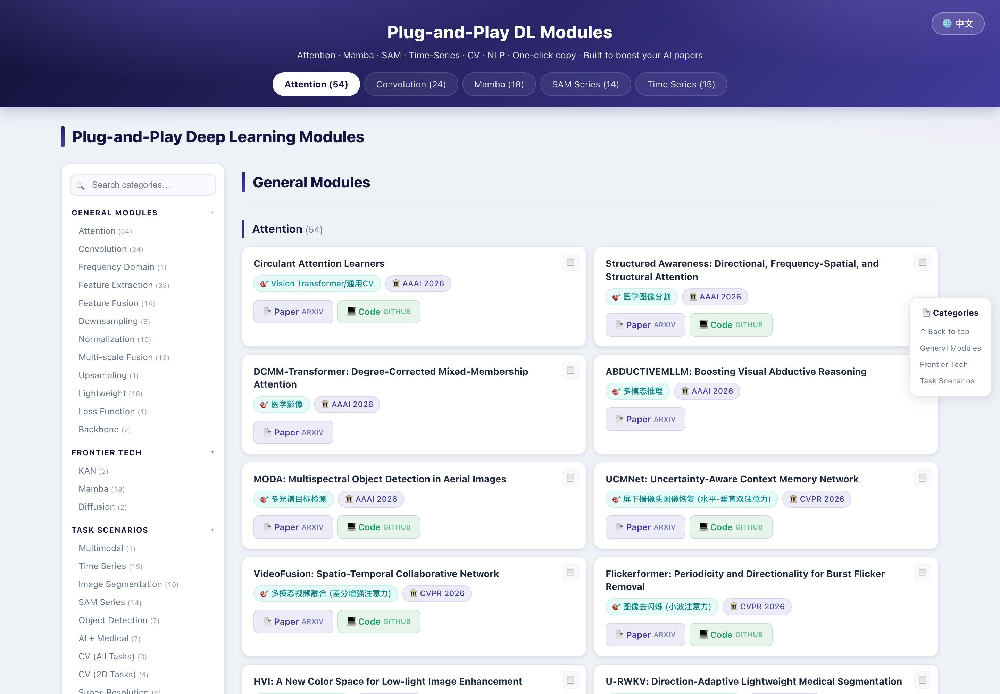

<h1 align="center">Plug-and-Play Deep Learning Modules<br><sub>即插即用深度学习模块 · 资源导航</sub></h1>

<p align="center">
  
  
  
  
  
  
  
</p>

<p align="center">
  <b>🌐 Language / 语言：</b> <a href="README.md">中文</a> &nbsp;|&nbsp; <b>English</b>
  &nbsp;·&nbsp; <a href="https://baseline-5r3.pages.dev/"><b>🔗 Live Demo</b></a>
</p>

<p align="center">
  
  <br><sub>Feature demo: category search · copy menu (name / paper / code) · collapsible groups · 中↔EN switch · responsive mobile</sub>
</p>

<p align="center">
  
</p>

<p align="center">
  
  <br><sub>Responsive mobile layout</sub>
</p>

---

A curated catalog of **285+** plug-and-play deep learning modules — covering Attention / Convolution / Mamba / SAM / Time-Series / CV / NLP — each with direct links to its **paper (arXiv)** and **open-source code (GitHub)**. Built to help AI research papers "level up".

A **zero-dependency, single-file** static web page — just open it in a browser, fully offline.

## ✨ Features

| Feature | Description |
|---------|-------------|
| 📚 **285+ module catalog** | Organized into *General Modules / Frontier Tech / Task Scenarios*; each entry shows the task, venue, and paper + code links |
| 🌐 **中/EN toggle** | One-click language switch (top-right), **remembers your choice** |
| 🔍 **Category search** | Autocomplete **dropdown** as you type; `↑ ↓` to select, `Enter` to jump, `Esc` to close |
| 📋 **One-click copy** | A `📋` button on each card opens a menu to copy the **module name / paper link / code link** to the clipboard, with a toast confirmation |
| 📂 **Collapsible groups** | Click a group heading to fold/unfold; **fold state persists across reloads** |
| 🎯 **Scroll-spy** | Sidebar highlights the current category and scrolls it into view (desktop) |
| 📱 **Responsive** | Sidebar + two-column cards on desktop; compact collapsible grid menu on mobile |
| 🎨 **Unified theme** | University of Auckland navy-purple palette |

## 📦 What's inside

- **General Modules (12):** Attention · Convolution · Frequency Domain · Feature Extraction · Feature Fusion · Downsampling · Normalization · Multi-scale Fusion · Upsampling · Lightweight · Loss Function · Backbone
- **Frontier Tech:** KAN · Mamba (State-Space Models) · Diffusion
- **Task Scenarios (20+):** Multimodal · Time Series · Image Segmentation · SAM Series · Object Detection · AI + Medical · CV tasks · Super-Resolution · Point Cloud · Video Prediction · 3D · NLP · Speech Recognition · Pose Estimation · Image Restoration / Enhancement / Generation · Semantic Segmentation, and more

> Each card shows: module name, 🎯 task, 🏛 venue, 📄 paper link, 💻 code link, 📋 copy button.

## 🚀 Usage

The whole project is a **single self-contained `index.html`** — no install, no build, no dependencies.

```bash
# Option 1: just double-click index.html

# Option 2: local server (recommended)
python3 -m http.server 8000
# then open http://localhost:8000
```

## 🛠️ Tech notes

- **Fully static:** one HTML file with inline CSS and vanilla JavaScript — no framework, bundler, or runtime.
- **External links** only point to each module's arXiv paper and GitHub repo; the page itself runs offline.
- **Local preferences** (`localStorage`): `site-lang` (UI language), `collapsed-groups` (folded group indices).
- **Compatibility:** modern browsers (Chrome / Edge / Safari / Firefox) and mobile.

## 🗂️ Project structure

```
.
├── index.html                    # Everything (HTML + inline CSS + inline JS + data)
├── README.md                     # Chinese README
├── README.en.md                  # English README (this file)
├── assets/screenshots/           # Screenshots & demo
│   ├── desktop.png               # Desktop (Chinese)
│   ├── desktop-en.png            # Desktop (English)
│   ├── mobile.png                # Mobile
│   └── demo.gif                  # Feature demo animation
└── .claude/launch.json           # Local preview server config
```

## ☁️ Deploy to Cloudflare Pages

This site is hosted on Cloudflare Pages. Since it's fully static, deployment is trivial:

- **A · Drag-and-drop:** Cloudflare Dashboard → *Workers & Pages* → *Create* → *Pages* → *Upload assets* → drop the folder → **Deploy**.
- **B · Git-connected:** *Connect to Git* → pick the repo → **Framework preset = None**, **build command empty**, **output directory = `/`** → auto-deploys on every push.
- **C · Wrangler CLI:**
  ```bash
  npx wrangler pages deploy . --project-name=plug-and-play-modules
  ```

## 🎯 Who it's for

Master's / PhD researchers and paper developers in **AI / CS / Remote Sensing / Medicine** — quickly find and reuse cutting-edge plug-and-play modules to improve paper experiments.

## ⚠️ Disclaimer

All resources are **for academic research only**; copyright of each paper and codebase belongs to the **original authors and open-source contributors**. Please contact us for removal in case of any infringement.
