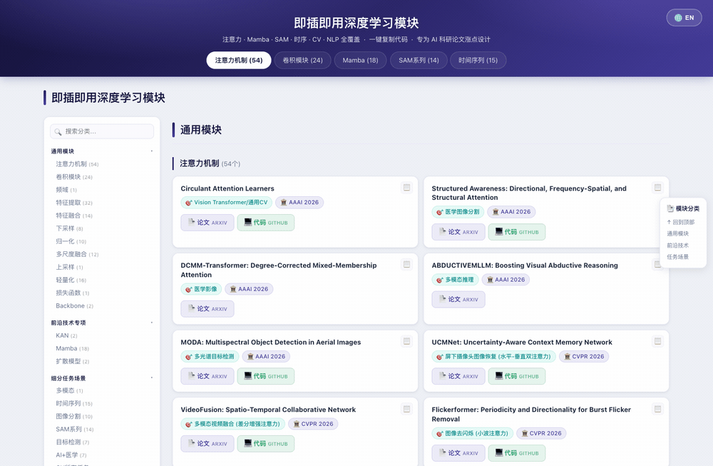
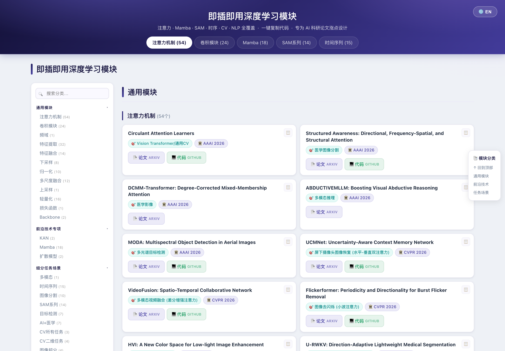
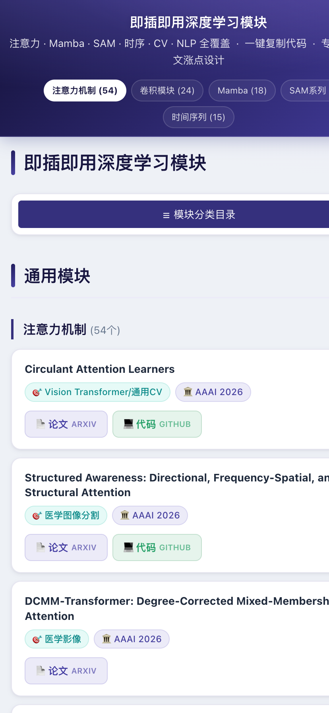

<h1 align="center">即插即用深度学习模块 · 资源导航<br><sub>Plug-and-Play Deep Learning Modules</sub></h1>

<p align="center">
  
  
  
  
  
  
  
</p>

<p align="center">
  <b>🌐 语言 / Language：</b> <b>中文</b> &nbsp;|&nbsp; <a href="README.en.md">English</a>
  &nbsp;·&nbsp; <a href="https://baseline-5r3.pages.dev/"><b>🔗 在线预览 / Live Demo</b></a>
</p>

<p align="center">
  
  <br><sub>功能演示：分类搜索下拉 · 一键复制（模块名 / 论文链接 / 代码链接）· 分组折叠 · 中英文切换 · 移动端响应式</sub>
</p>

<p align="center">
  
</p>

<p align="center">
  
  <br><sub>移动端响应式布局</sub>
</p>

---

收录 **285+** 即插即用深度学习模块，覆盖 注意力 / 卷积 / Mamba / SAM / 时序 / CV / NLP 等多领域任务，每个模块附**论文（arXiv）**与**开源代码（GitHub）**直达链接。专为 AI 科研论文"涨点"设计。

一个 **零依赖、单文件** 的静态网页，双击即可离线使用。

## ✨ 功能特性

| 功能 | 说明 |
|------|------|
| 📚 **285+ 模块导航** | 按「通用模块 / 前沿技术专项 / 细分任务场景」三大板块分类，每个模块含研究方向、发表会议、论文与代码链接 |
| 🌐 **中英文切换** | 右上角 `🌐 EN / 中文` 一键切换界面语言，**记住上次选择** |
| 🔍 **分类搜索** | 侧边栏搜索框输入即弹出**下拉自动补全**，支持 `↑ ↓` 选择、`Enter` 跳转、`Esc` 关闭 |
| 📋 **一键复制** | 每张卡片右上角 `📋` 弹出菜单，可复制**模块名 / 论文链接 / 代码链接**到剪贴板，带 toast 提示 |
| 📂 **分组折叠** | 三大分组标题可点击折叠/展开，**折叠状态跨刷新记忆** |
| 🎯 **滚动高亮** | 阅读时侧边栏自动高亮当前分类，并滚动到可视区（桌面端） |
| 📱 **响应式布局** | 桌面端「侧栏目录 + 双列卡片」；移动端目录收起为紧凑宫格菜单 |
| 🎨 **统一主题** | University of Auckland 深靛紫（navy-purple）配色 |

## 📦 内容概览

- **通用模块（12 类）**：注意力机制 · 卷积模块 · 频域 · 特征提取 · 特征融合 · 下采样 · 归一化 · 多尺度融合 · 上采样 · 轻量化 · 损失函数 · Backbone
- **前沿技术专项**：KAN · Mamba（状态空间模型）· 扩散模型
- **细分任务场景（20+ 类）**：多模态 · 时间序列 · 图像分割 · SAM 系列 · 目标检测 · AI+医学 · CV 任务 · 图像超分 · 点云 · 视频预测 · 3D 任务 · NLP · 语音识别 · 人体姿态估计 · 图像恢复 / 增强 / 生成 · 语义分割 等

> 每张模块卡片包含：模块名称、🎯 适用任务、🏛 发表会议/期刊、📄 论文链接、💻 代码链接、📋 复制按钮。

## 🚀 使用方式

本项目是**单个自包含的 `index.html`**，无需安装、无需构建、无外部依赖。

```bash
# 方式一：直接双击 index.html 用浏览器打开

# 方式二：本地服务器（推荐）
python3 -m http.server 8000
# 访问 http://localhost:8000
```

## 🛠️ 技术说明

- **纯静态**：单文件 HTML，内联 CSS 与原生 JavaScript，无框架、无打包、无第三方运行时。
- **外部链接**：仅指向各模块的 arXiv 论文页与 GitHub 仓库，页面本身可完全离线运行。
- **本地偏好存储**（`localStorage`）：`site-lang`（界面语言）、`collapsed-groups`（已折叠分组索引）。
- **兼容性**：现代浏览器（Chrome / Edge / Safari / Firefox）及移动端均可运行。

## 🗂️ 项目结构

```
.
├── index.html                    # 全部内容（HTML + 内联 CSS + 内联 JS + 数据）
├── README.md                     # 中文说明（本文件）
├── README.en.md                  # English README
├── assets/screenshots/           # 界面截图与演示
│   ├── desktop.png               # 桌面端（中文）
│   ├── desktop-en.png            # 桌面端（英文）
│   ├── mobile.png                # 移动端
│   └── demo.gif                  # 功能演示动图
└── .claude/launch.json           # 本地预览服务器配置
```

## ☁️ 部署到 Cloudflare Pages

本站即托管于 Cloudflare Pages。因为是纯静态项目，部署非常简单：

**方式 A · 拖拽上传（最快）**
1. 登录 [Cloudflare Dashboard](https://dash.cloudflare.com/) → **Workers & Pages** → **Create** → **Pages** → **Upload assets**。
2. 直接把项目文件夹（含 `index.html`）拖入上传，命名项目后点击 **Deploy**。
3. 获得 `https://<你的项目名>.pages.dev` 访问地址。

**方式 B · 连接 Git 仓库（自动持续部署）**
1. 把项目推送到 GitHub / GitLab。
2. Cloudflare Pages → **Connect to Git** → 选择该仓库。
3. 构建设置：**Framework preset = None**，**Build command 留空**，**Build output directory = `/`**（根目录）。
4. 保存后每次 push 自动重新部署。

**方式 C · Wrangler CLI**
```bash
npx wrangler pages deploy . --project-name=plug-and-play-modules
```

## 🎯 适用人群

AI / 计算机 / 遥感 / 医学方向的**科研硕博生**与**论文开发者**——快速检索、复用前沿即插即用模块，为论文实验提供改进思路。

## ⚠️ 版权声明

本网站资源**仅供学术科研使用**，所有模块的论文与代码版权归**原论文作者及开源贡献者**所有。若涉及侵权，请联系删除。
